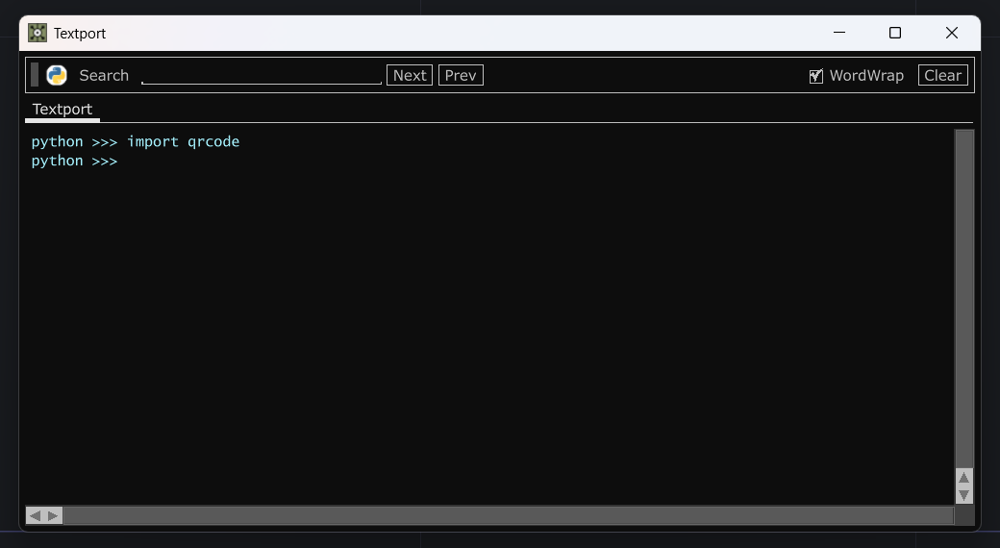

# TouchDesigner Virtual Environment Example

This repository is an example of how you can set-up a TouchDesigner virutal environment yourself.

## Required Tools

[uv](https://docs.astral.sh/uv/) - a python package manager

## TouchDesigner Previz Image Generation

Project code can be found at:

`TouchDesigner/`

**Requirements**

* Python 3.11

### Setup

Install Python `3.11`  

```pwsh
uv python install 3.11
```

We'll be using a special sub directory as the location for any python virtual environment elements that TouchDesigner will use. In your terminal navigate to `TouchDesigner/ext-python`.  

Create your virtual environment:  

```pwsh
uv venv --python 3.11 
```

Activate the virtual environment

```pwsh
.venv\Scripts\activate
```

Fetch all dependencies

```base
uv pip install -r requirements.txt
```

In order to access the newly added libraries in TouchDesigner we need to add our `ext-python` directory to path. In our TouchDesigner project you'll find a DAT called `startupUtils` that has a few helper methods:

```python
import sys

external_python:str = f"{project.folder}/ext-python/.venv/Lib/site-packages"


def check_path() -> None:
    show_path_contents()
    print("\n")

    if external_python not in sys.path:
        print("adding external python to path")
        sys.path.append(external_python)
        print("\n")
        print("updated path contents")
        show_path_contents()
    
def show_path_contents() -> None:
    print("current dirs on path -----")
    for each in sys.path:
        print(each)
        
```

These are called by an execute DAT when the project starts and ensures that we can access our libraries in TouchDesigner.

We can test that this has all worked correctly by importing the library we installed in the textport:



### Operation

### Considerations

It's worth remembering that anything in our `.venv` folder should not be committed to a repo. This is a local cache of the libraries that exist somewhere else that we're using for this project. Because of that whenever we clone a project we need ensure that we go through the steps of initializing the virtual environment that are laid out above.

Initialization order matters - meaning that you may need to force cook an op that has an import from an external library. You'll only see this on complete restarts, so it's worth saving some time to do several complete restarts to track down all of the nitty gritty for your start-up order an considerations.
